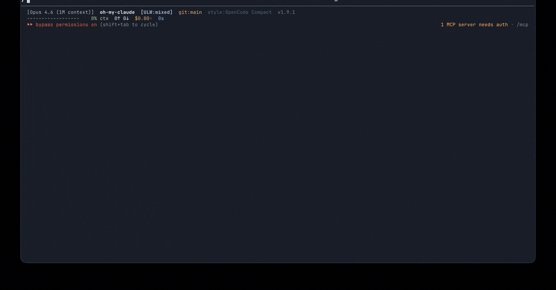

# oh-my-claude

**What if Claude Code couldn't cut corners?**

[](CHANGELOG.md)
[](LICENSE)
[]()
[]()

A cognitive quality harness for Claude Code. Bash hooks, skills, and specialist agents that enforce thinking, testing, and review as structural requirements -- not suggestions.

> **Specialist agents activate automatically based on your task.** You don't need to learn agent names -- just describe what you want to accomplish, and `/ulw` handles the rest.



*Two minutes of `/ulw-demo` showing the quality gates fire on a real edit — see [Quick start](#quick-start) below to install and try it yourself.*

## What you get

- **Hard quality gates that actually block.** Claude can't mark a task done until tests, review, and verification are complete — no more "I've made the changes" with broken code or skipped review.
- **Domain routing across coding, writing, research, ops.** Each domain gets its own specialist chain. Not just a coding tool that accepts prose.
- **Session continuity through compaction.** Objectives, decisions, and review state survive context compaction — you don't lose the plot mid-task.

---

## Quick start

Requires `jq` and `rsync`. macOS: `brew install jq` (`rsync` is preinstalled). Debian/Ubuntu: `apt install jq rsync`. `install.sh` hard-fails if `jq` is missing.

```bash
# One-liner (clones to ~/.local/share/oh-my-claude for you):
curl -fsSL https://raw.githubusercontent.com/X0x888/oh-my-claude/main/install-remote.sh | bash

# OR manual clone (audit before installing):
git clone https://github.com/X0x888/oh-my-claude.git ~/.local/share/oh-my-claude
bash ~/.local/share/oh-my-claude/install.sh
```

After install:

1. **Restart Claude Code.** Required — hooks only load at session start, so `/ulw` silently no-ops in your current session until you restart.
2. **Verify**: `bash ~/.local/share/oh-my-claude/verify.sh`
3. **Try it**: `/ulw-demo` — a guided walkthrough (under 2 minutes) that fires the quality gates on a real edit so you see them work.
4. **Real work**: `/ulw fix the failing test and add regression coverage` (or anything, in any domain).

Both install paths keep Claude Code's permission prompts on; once you trust the harness, [`--bypass-permissions`](#power-user-setup) removes them. Quality gates apply either way.

Already in Claude Code and want to skip the manual steps? See [AI-assisted install](#ai-assisted-install) below.

## AI-assisted install

Already in Claude Code? Paste one of these prompts directly. Each is self-contained, but the canonical step-by-step lives in the cloned repo's [`AGENTS.md` § "Agent Install Protocol"](AGENTS.md#agent-install-protocol--installing-or-updating-oh-my-claude) — the prompts point there so the README and the protocol don't drift.

**First-time install:**

> Install oh-my-claude. Do these in order:
> 1. Clone `https://github.com/X0x888/oh-my-claude.git` into `~/.local/share/oh-my-claude` (canonical path — matches the curl-pipe-bash bootstrapper).
> 2. Read `~/.local/share/oh-my-claude/AGENTS.md` § "Agent Install Protocol" and follow it end-to-end.
> 3. Use `--model-tier=balanced` (don't ask me).
> 4. After `verify.sh` passes, quote its "What next?" footer back to me verbatim — do not paraphrase.
> 5. Tell me explicitly to restart Claude Code and run `/ulw-demo` in the new session. Hooks won't fire in this current session.

**Update an existing install:**

> Update oh-my-claude. Read `repo_path=` from `~/.claude/oh-my-claude.conf`, then follow `<repo_path>/AGENTS.md` § "Agent Install Protocol" → Step 2 (Update). After running `install.sh` and `verify.sh`, list the commits the pull brought in and tell me whether to restart Claude Code (only if the bundle changed).

## Updating an existing install

```bash
cd ~/.local/share/oh-my-claude     # or your repo_path from ~/.claude/oh-my-claude.conf
git pull && bash install.sh
bash verify.sh
```

Restart Claude Code if any bundle file changed; the `verify.sh` summary lists orphans if files were removed.

Your `--model-tier` preference persists in `~/.claude/oh-my-claude.conf` and re-applies automatically. The statusline shows a yellow `↑v<version>` arrow when the source repo is ahead of the installed bundle — re-run `install.sh` to sync.

`install.sh` overwrites bundled files but preserves `settings.json` merges, `omc-user/overrides.md`, and custom agents or skills whose names are outside the bundle. See FAQ: [*How do I update?*](docs/faq.md#how-do-i-update-oh-my-claude) and [*Will updating overwrite my changes?*](docs/faq.md#will-updating-overwrite-my-changes) for the full safety matrix.

---

## The problem

Claude Code is powerful, but out of the box it cuts corners in predictable ways:

- **It writes code but doesn't test it.** You get a diff that looks right, breaks in practice, and you're the one who finds out.
- **It stops before work is actually done.** "I've made the changes" -- but there's no review, no verification, no evidence it works.
- **It defers unfinished work to "a future session."** Wave 1 done, Wave 2 is next. Except Wave 2 never happens.
- **It gives surface-level advice without reading actual code.** Generic patterns instead of grounded analysis of what's in front of it.
- **It chains tool calls without thinking between them.** Mechanical sequences that look productive but skip the reasoning that catches mistakes.
- **It only works well for coding.** Ask it to write a proposal, research a decision, or plan an initiative and it falls back to code-shaped workflows.

These aren't edge cases. They're the daily experience of anyone using Claude Code for real work.

## What oh-my-claude does

oh-my-claude enforces cognitive quality through structure, not prompt engineering. Instead of asking Claude to please think harder, it installs bash hooks that intercept Claude Code's lifecycle events -- prompt submission, session compaction, stop attempts -- and injects domain-aware context, quality requirements, and hard gates that Claude cannot bypass.

The result: Claude classifies your intent before acting, routes work to specialist agents, thinks between tool calls, and literally cannot mark a task as done until review and verification are complete.

## Feature highlights

### Hard quality gates

Stop event blocking prevents Claude from finishing until testing and review are done. Wrote code but didn't run the tests? Blocked. Made edits but skipped the reviewer? Blocked. Deferred work to a "future session" without a checkpoint? Blocked. Edited 3+ files but skipped the excellence review? Blocked. Caps on each gate prevent infinite loops -- if Claude can't satisfy the gates, it surfaces the gap instead of spinning.

### Prescribed reviewer sequence

On complex tasks (3+ edited files by default), the stop-hook stops guessing which reviewer to run next and prescribes the sequence. Each reviewer owns one distinct dimension:

- `quality-reviewer` — bug hunt, code quality
- `design-reviewer` — design quality (auto-activates when UI files edited)
- `metis` — stress-test hidden assumptions
- `excellence-reviewer` — completeness against the original objective
- `editor-critic` — doc clarity and accuracy
- `briefing-analyst` — traceability (kicks in at 6+ files)

Each gate block message names the specific next reviewer. A `VERDICT: CLEAN|SHIP|FINDINGS (N)` line in each reviewer's output tells the hook whether the dimension was ticked. Doc-only edits route straight to `editor-critic` and skip the code-verification gate, so fixing a typo in CHANGELOG doesn't re-trigger `npm test`.

### Intent classification

A bash state machine classifies every prompt into one of 5 intent categories -- execution, continuation, advisory, checkpoint, or session-management -- crossed with 6 domain types: coding, writing, research, operations, mixed, and general. Claude knows *what you're asking* and *what domain you're in* before it takes a single action. Advisory questions get answered directly; execution prompts get the full specialist pipeline.

### Multi-domain routing

oh-my-claude is not a coding tool that happens to accept prose. Each domain has its own specialist chain:

- **Coding** -- quality-planner for scoping, quality-researcher for context, specialist developers (frontend, backend, fullstack, iOS, DevOps, test), quality-reviewer and excellence-reviewer for verification
- **Writing** -- writing-architect for structure, draft-writer for content, editor-critic for polish
- **Research** -- librarian for source gathering, briefing-analyst for synthesis, metis for stress-testing conclusions
- **Operations** -- chief-of-staff turns vague asks into structured deliverables, action plans, and decision memos

### Session continuity

Pre- and post-compact hooks snapshot the working state when Claude Code compacts a session. Objectives, domain classification, accepted decisions, specialist conclusions, in-flight specialist dispatches, pending review obligations, and task progress all survive compaction. When the session resumes, context is rehydrated -- not reconstructed from scratch.

### Permissioned agents

32 specialist agents, each with `disallowedTools` enforced. Agents can read, search, analyze, and plan -- but they cannot edit files. The main thread owns all mutations. This means agents provide high-quality analysis without unsupervised writes, and the main thread remains the single source of truth for code changes.

### Project Council

The `/council` skill dispatches a multi-role evaluation panel that inspects your project from the perspectives a full product team would bring: Product Manager, UX Designer, Security Engineer, Data/Analytics Lead, SRE, and Growth Lead. Each role-lens agent evaluates independently with a non-overlapping mandate, and findings are synthesized into a single prioritized assessment. The system auto-detects broad evaluation prompts like "evaluate my project" under `/ulw` and triggers the council flow automatically. Solo developers get the cross-functional perspective that a full team provides through daily friction -- without the team.

### Distinctive UI by default

Type `/ulw build me a landing page for X` and the harness automatically drives a 9-section Design Contract — Visual Theme, Color Palette with hex values, Typography Rules, Component Stylings with hover/focus states, Layout Principles with explicit spacing scale, Depth & Elevation, Do's and Don'ts, Responsive Behavior, and an Agent Prompt Guide — before any code is written. Inspired by [VoltAgent/awesome-design-md](https://github.com/VoltAgent/awesome-design-md), the contract forces commitment to specifics rather than vague aesthetic claims, with 15 brand-archetype priors (Linear, Stripe, Vercel, Notion, Apple, Airbnb, Spotify, Tesla, Figma, Discord, Raycast, Anthropic, Webflow, Mintlify, Supabase) framed as anti-anchors so the agent picks a coherent point of departure and then commits to what it will do *differently*. Scope-aware: a "build a page" prompt gets the full contract; a "fix the button padding" prompt preserves existing tokens. **Inline emission is captured automatically** — the contract block the agent emits is persisted to a session-scoped file so `design-reviewer` and `visual-craft-lens` can grade drift on subsequent edits even when no `DESIGN.md` exists at the project root. **Cross-session archetype memory** prevents the harness from repeating the same anchor (e.g., Stripe twice) on the same project across sessions; when ≥2 priors are detected for the project's git-remote-keyed identity, the router advises picking a different archetype. To opt out for backend/internal work, include `no design polish` or `functional only` in your prompt.

### Zero dependencies

No npm. No TypeScript. No Node.js runtime. No plugin framework. The entire harness is bash scripts and jq. It works anywhere Claude Code runs, installs in seconds, and leaves no footprint beyond the `~/.claude/` directory.

## Usage examples

**Coding**
```
/ulw debug why settings saves but shows stale data until refresh
```

**Writing**
```
ulw draft a project proposal for an AI-assisted research workflow
```

**Research**
```
/ulw compare server-session auth vs JWT and recommend one
```

**Operations**
```
ulw turn these meeting notes into an action plan and follow-up email
```

**Project evaluation**
```
/council
/ulw evaluate my project and plan for improvements
```

---

## How it works

When you submit a prompt, the intent router (`prompt-intent-router.sh`) classifies it by intent category and domain, then injects the appropriate context and specialist instructions into Claude's working memory. Claude processes the task using the routed specialist agents -- each scoped to its domain and constrained by permission boundaries. When Claude attempts to stop, the stop guard (`stop-guard.sh`) checks whether review and verification obligations are met. If they aren't, the stop is blocked and Claude is told exactly what's missing.

The core state machine (`common.sh`) handles intent classification, domain scoring, session state tracking, and the quality gate logic. All state is managed in bash -- no external services, no databases, no background processes.

For the full architecture, see [docs/architecture.md](docs/architecture.md).

## Comparison

| | Vanilla Claude Code | oh-my-claudecode | oh-my-claude |
|---|---|---|---|
| **Quality enforcement** | None | None | Hard stop gates |
| **Intent classification** | None | None | 5-category state machine |
| **Domain coverage** | Code-only | Code-focused | Coding, writing, research, ops |
| **Dependencies** | -- | Node.js, TypeScript | bash + jq |
| **Agent safety** | Unrestricted | Varies | disallowedTools enforced |
| **Session continuity** | Lost on compaction | Varies | Pre/post-compact hooks |
| **Architecture** | Monolithic | Plugin/orchestration | Harness hooks |

---

## Repository structure

```
oh-my-claude/
├── install.sh / uninstall.sh / verify.sh   # Install, remove, and verify
├── bundle/dot-claude/                       # Installs to ~/.claude/
│   ├── agents/          (32 agents)         # Specialist agent definitions
│   ├── skills/          (20 skills)         # Skill definitions + autowork hooks
│   ├── quality-pack/                        # Lifecycle hooks + memory files
│   ├── output-styles/                       # Output format templates
│   └── statusline.py                        # Custom statusline widget
├── config/settings.patch.json               # Merged into user settings on install
├── tests/               (35 bash + 1 py)    # Intent, quality gates, stall, resume, e2e, install/uninstall merge, concurrency, cross-session-lock, post-merge, repro redaction, discovered-scope, finding-list, mark-deferred, state-io, classifier-replay, serendipity-log, cross-session-rotation, classifier, show-report, install-remote, phase8-integration, verification-lib, agent-verdict-contract, gate-events, discover-session, design-contract, inline-design-contract, archetype-memory, ulw-pause, bias-defense-classifier, bias-defense-directives, metis-on-plan-gate, statusline
├── tools/                                    # Developer-only tools (replay-classifier-telemetry.sh, classifier-fixtures/)
└── docs/                                    # Architecture, customization, FAQ, prompts
```

> **Why `dot-claude` instead of `.claude`?** Claude Code's permission system treats paths containing `.claude/` as sensitive, triggering prompts on every edit during development. The installer copies `bundle/dot-claude/` into `~/.claude/` on your machine. This is the same pattern used by oh-my-zsh, chezmoi, etc.

### Available skills

Skills are invoked as slash commands or routed automatically by the intent classifier.

| Skill (mnemonic) | Command | Purpose |
|---|---|---|
| **Run a task** | | |
| ulw | `/ulw <task>` | Maximum-autonomy professional workflow |
| **Think before acting** | | |
| plan-hard *(plan)* | `/plan-hard <task>` | Decision-complete planning without edits |
| prometheus *(interview)* | `/prometheus <goal>` | Interview-first planning for ambiguous work |
| metis *(stress-test)* | `/metis <plan>` | Pressure-test a plan for hidden risks |
| oracle *(second opinion)* | `/oracle <issue>` | Deep debugging or architecture second opinion |
| librarian *(docs lookup)* | `/librarian <topic>` | Official docs and reference research |
| **Review & evaluate** | | |
| review-hard *(review)* | `/review-hard [focus]` | Findings-first code review |
| research-hard *(research)* | `/research-hard <topic>` | Targeted context gathering |
| council *(evaluation panel)* | `/council [focus] [--deep]` | Multi-role project evaluation with top-finding verification, then **Phase 8** wave-by-wave execution when fixes are requested ("implement all", "exhaustive", "fix everything"). `--deep` escalates lenses to opus. |
| **Build** | | |
| frontend-design *(visual craft)* | `/frontend-design <task>` | Distinctive design-first frontend work |
| atlas *(repo bootstrap)* | `/atlas [focus]` | Bootstrap or refresh repo instruction files |
| **Workflow control** (mid-session) | | |
| ulw-demo *(onboarding)* | `/ulw-demo` | Guided walkthrough with real quality gates |
| ulw-status *(diagnostics)* | `/ulw-status` | Show current session state and Council Phase 8 wave-plan progress. `summary` / `classifier` arguments swap modes. |
| ulw-report *(retrospective)* | `/ulw-report [last\|week\|month\|all]` | Markdown digest of cross-session activity — sessions, gate fires, top reviewers, classifier misfires, Serendipity catches, finding/wave outcomes |
| ulw-skip *(skip a gate)* | `/ulw-skip <reason>` | Skip current quality gate block once |
| mark-deferred *(triage findings)* | `/mark-deferred <reason>` | Bulk-defer pending discovered-scope findings with a one-line reason — pass the gate without silent skipping |
| ulw-pause *(user-decision pause)* | `/ulw-pause <reason>` | Declare a legitimate user-decision pause without tripping the session-handoff gate. Cap 2/session |
| ulw-off *(deactivate)* | `/ulw-off` | Deactivate ultrawork mode mid-session |
| skills *(this list)* | `/skills` | List all available skills with usage guide |

> The mythology-named skills (atlas, metis, oracle, prometheus, librarian) carry one-word mnemonics — see [`docs/glossary.md`](docs/glossary.md) for the rationale behind each name.
>
> `/ulw` also responds to the aliases `/autowork` and `/ultrawork` (preferred) plus `sisyphus` (legacy). Use `/ulw` in new prompts; the aliases stay for muscle memory.

## Power-user setup

Once you've run `/ulw-demo`, watched the quality gates fire, and decided you trust the harness, you can remove Claude Code's per-tool approval prompts:

```bash
bash install.sh --bypass-permissions
```

This is opt-in. It skips Claude Code's built-in "allow this tool?" prompts so `/ulw` runs without interruption. The harness's quality gates (verification, reviewer dispatch, stop-guard) keep working — those are independent of Claude Code's confirmation layer. Switch back at any time by re-running `bash install.sh` without the flag.

Other install options:

```bash
bash install.sh --no-ios                # Skip iOS-specific agents
bash install.sh --model-tier=economy    # All agents use Sonnet (cheaper)
bash install.sh --model-tier=quality    # All agents use Opus (max quality)
bash install.sh --git-hooks             # Install .git/hooks/post-merge auto-sync prompt
bash ~/.claude/switch-tier.sh economy   # Switch tier post-install (from anywhere)
bash uninstall.sh                       # Cleanly remove the harness
```

`--git-hooks` installs a `post-merge` hook inside this repo's `.git/hooks/`
that detects when `git pull` brings in bundle changes and reminds you to
re-run `install.sh`. Set `OMC_AUTO_INSTALL=1` when merging to run the
installer automatically. The hook never overwrites a pre-existing non-
oh-my-claude `post-merge` hook.

## Testing

The harness includes both a post-install verifier and dedicated test scripts:

```bash
bash verify.sh                              # Installation integrity check
bash tests/test-intent-classification.sh    # Intent routing logic
bash tests/test-quality-gates.sh            # Stop guard enforcement
bash tests/test-stall-detection.sh          # Loop detection
bash tests/test-e2e-hook-sequence.sh        # End-to-end hook sequence
bash tests/test-settings-merge.sh           # Install settings merge logic
bash tests/test-uninstall-merge.sh          # Uninstall settings cleanup logic
bash tests/test-common-utilities.sh         # Shared utility functions
bash tests/test-session-resume.sh           # Session resume cycle
bash tests/test-concurrency.sh              # Lock primitive stress test
bash tests/test-install-artifacts.sh        # Installed-file artifact assertions
bash tests/test-post-merge-hook.sh          # --git-hooks post-merge drift detection
bash tests/test-repro-redaction.sh          # omc-repro.sh privacy contract regression
bash tests/test-discovered-scope.sh         # Discovered-scope capture + wave-aware gate
bash tests/test-finding-list.sh             # Council Phase 8 findings.json artifact
bash tests/test-state-io.sh                 # Extracted lib/state-io.sh module
bash tests/test-classifier.sh               # Extracted lib/classifier.sh module (symbol presence + smoke)
bash tests/test-classifier-replay.sh        # Classifier regression replay against curated fixtures
bash tests/test-serendipity-log.sh          # Serendipity Rule analytics logging
bash tests/test-cross-session-rotation.sh   # Cross-session JSONL aggregate cap helper
bash tests/test-show-report.sh              # /ulw-report skill backend (cross-session digest)
bash tests/test-install-remote.sh           # curl-pipe-bash bootstrapper (install-remote.sh)
bash tests/test-phase8-integration.sh       # Council Phase 8 wave-cap wiring (record-finding-list ↔ stop-guard)
bash tests/test-verification-lib.sh         # Extracted lib/verification.sh module (symbol presence + smoke)
bash tests/test-agent-verdict-contract.sh   # Universal VERDICT contract regression net (all 32 agents)
bash tests/test-bias-defense-classifier.sh  # Bias-defense prompt-shape classifiers + plan-complexity extraction
bash tests/test-bias-defense-directives.sh  # prometheus-suggest + intent-verify directive injection
bash tests/test-metis-on-plan-gate.sh       # Metis-on-plan stop-guard gate (Check 6, opt-in)
bash tests/test-gate-events.sh              # Per-event outcome attribution (gate_events.jsonl helper + wiring)
bash tests/test-discover-session.sh         # Cross-project session-discovery cwd filter (record-finding-list / show-status)
bash tests/test-design-contract.sh          # 9-section Design Contract regression net (UI agents + skill + router)
python3 -m unittest tests.test_statusline   # Statusline widget
```

## Customization

The harness is designed to be extended. Agent definitions, quality gate thresholds, domain routing rules, and specialist chains can all be modified to match your workflow.

- [Architecture](docs/architecture.md) -- system design and component interaction
- [Customization](docs/customization.md) -- what's configurable and how to change it safely
- [FAQ](docs/faq.md) -- common questions and troubleshooting
- [Prompts](docs/prompts.md) -- prompt reference and routing details
- [Glossary](docs/glossary.md) -- decoder ring for the mythology-named skills and internal terms
- [Showcase](docs/showcase.md) -- real-world transcripts where the gates caught a bug or stalled completion (community-contributed)

## Contributing

Contributions are welcome. See [CONTRIBUTING.md](CONTRIBUTING.md) for guidelines on submitting changes, the review process, and how to test modifications to the harness locally.

## License

[MIT](LICENSE)
